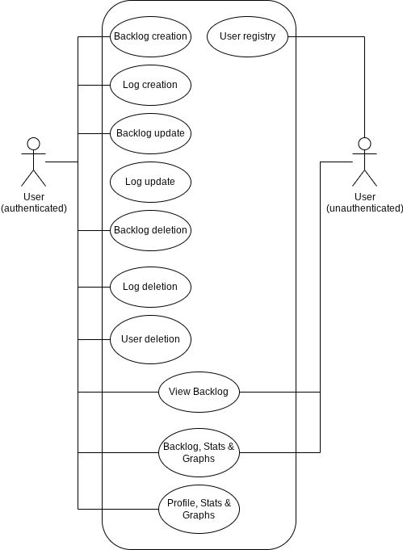

# Functional Specification Document (FSD)
## User Stories
- Actors  
- Preconditions  
- Main Flow  
- Alternative Flows  
- Postconditions

1. Use case: User registry
- Actor: platform user.
- Preconditions: unauthenticated, not banned, IP not banned (in case IP blacklist mechanisms such as fail2ban are implemented).
- Main Flow:
  1. User accesses the authentication form.
  2. User chooses to register.
  3. Input data & send it to the server.
  4. Account is registered.
  5. User is redirected to the login form.
- Alternative Flows:
  1. Invalid user data:
    1. User registry data is invalid (insecure password, already registered gmail, etc).
    2. Feedback is provided to the user via notification, pop ups, etc.
- Postconditions:
  1. User can enter credentials to authenticate themselves in the system.

2. Use case: Backlog creation
- Actor: platform user.
- Preconditions: authenticated, not banned (from now on, a 'user' refers to a not banned one unless mentioned otherwise).
- Main Flow:
  1. User gets to the Backlogs screen via a shortcut (buttons, navbar, etc).
  2. User clicks on a "Create Backlog" button/label.
  3. User enters Backlog Theme.
  4. User confirms Backlog creation.
- Alternative Flows:
  1. User enters Backlog Theme.
    1. User toggles on the "Public" option.
    2. User confirms the preference.
    3. Return to step 4 of the Main Flow.
- Postconditions:
  1. A Backlog instance is created in the database.
  2. Backlog's owner can fetch & list the Backlog in the Backlogs screen.

3. Use case: Backlog update
- Actor: platform user.
- Preconditions: authenticated, owns a Backlog.
- Main flow:
  1. User selects a Backlog from the Backlogs listing screen.
  2. User enters an "edit" screen.
  3. User sends new title.
  4. Backlog's title is updated.
- Alternative Flows:
  1. User sends new title.
    1. New title is empty/invalid (only whitespaces).
    2. Edit is unsuccessful (frontend should avoid sending the request in the first place).
- Postconditions:
  1. Backlog's title is updated on the database.
  2. Viewing the Backlog should display the new title.

4. Use case: Backlog deletion
- Actor: platform user.
- Preconditions: authenticated, is viewing a Backlog's listing, is Backlog's owner.
- Main Flow:
  1. User clicks on Backlog's config button/label.
  2. User scrolls/reveals the "danger zone" section.
  3. User selects "Delete Backlog" option.
  4. User confirms the action via pop up, text input, etc.
  5. User returns to Backlogs listing screen.
- Alternative Flows:
  1. User selects "Delete Backlog" option.
    1. User checks "Hard delete" option.
    2. User confirms preference via pop up, text input, etc.
    3. Return to step 4 of Main Flow.
- Postconditions:
  1. Deletion of Backlog from Backlog listing.
  2. Depending on wether or not Alternative Flow 1 has been completed:
    1. Alternative Flow 1 not completed: the field "deleted_at" is populated on the deleted Backlog, excluding it from being fetched (soft delete, Backlog persists on database).
    2. Alternative Flow 2 completed: the Backlog is deleted from the database, cascading into all related Logs, deleting them as well (hard delete).

5. Use case: Log creation.
- Actor: platform user.
- Preconditions: authenticated, is viewing a Backlog's listing, is Backlog's owner.
- Main Flow:
  1. User clicks on "Create Log" button/label.
  2. User enters title (required field).
  3. User views Log's preview.
  4. User confirms creation.
  5. Return to Backlog's listing with appended Log.
- Alternative Flows:
  1. User enters title.
    1. User populates other fields.
    2. Return to step 4 of Main Flow.
  2. User enters title.
    1. Title is empty or invalid (only whitespaces).
    2. Frontend avoids making the request to the server, as well as providing feedback to the user via a notification, pop up, etc.
- Postconditions:
  1. Log saved in the database.
  2. Log is fetched & listed when listing its related Backlog.

6. Use case: Log update
- Actor: platform user.
- Preconditions: authenticated, is viewing a Backlog's listing, is Backlog's owner.
- Main Flow:
  1. User clicks on a log's edit/config button/label.
  2. User populates/updates desired fields.
  3. User checks on the miniature preview.
  4. User confirms update via pop up, double click, etc.
  5. User returns to Backlog's listing.
- Postconditions:
  1. Updated/populated field changes are applied on the database.
  2. The log is reordered based on the ordering criteria & the updated fields.

7. Use case: Log deletion
- Actor: platform user.
- Preconditions: authenticated, is viewing a Backlog's listing, is Backlog's owner.
- Main Flow:
  1. User clicks on Log's config/edit button/label.
  2. User selects "Delete Log" option.
  3. User confirms the action via pop up, text input, etc.
  4. User returns to Backlog's listing screen.
- Alternative Flows:
  None.
- Postconditions:
  1. Deletion of Log from Backlog's related Logs.
  2. Deletion of Log from database.

8. Use case: Backlog, Stats & Graphs
- Actors: user (authenticated or unauthenticated)
- Preconditions: viewing a Backlog's listing (private or public)
- Main Flow:
  1. User clicks the "Stats & Graphs" button/label.
  2. User is moved to a screen where the Backlog's stats are displayed.
  3. At the same time, graphs are generated ('status' bar graphs, average estimated time, etc).
- Alternative Flows:
  1. Generate PDF: user clicks a button that downloads the stats & graphs.
- Postconditions
  None.

9. Use case: Profile, Stats & Graphs
- Actors: platform user
- Preconditions: authenticated, viewing profile screen.
- Main Flow:
  1. User clicks the "Stats & Graphs" button/label.
  2. User is moved to a screen where the Profile's stats are displayed.
  3. At the same time, graphs are generated ('Highest amount of Logs Backlogs' bar graphs, etc).
- Alternative Flows:
  1. Generate PDF: user clicks a button that downloads the stats & graphs.
- Postconditions
  None.

10. Use case: User deletion
- Actors: platform user
- Preconditions: authenticated, viewing profile screen.
- Main Flow:
  1. User clicks the "config" button/label.
  2. User scrolls/reveals the "danger zone" section.
  3. User confirms the action via pop up, text input, etc.
  4. User is logged off.
  5. User is redirected to the landing page.
- Alternative Flows:
  None.
- Postconditions:
  1. User account is deleted from database (hard delete), cascading into all user's Backlogs & Logs.
  2. Registered email can be used to register a new account again.

11. Use case: View Backlog
- Actors: user (authenticated or unauthenticated)
- Preconditions: access to the Backlog (be Backlog's owner or Backlog is public).
- Main Flow:
  1. User accesses a Backlog listing, fetching accessible Backlogs (public or owned).
  2. User clicks on selected Backlog.
- Alternative Flows:
  1. User accesses a Backlog via URL.
    1. If User is Backlog's owner, it's displayed normally.
    2. If Backlog is public, display Backlog with limited permissions (read only).
    3. If previous checks fail, return to Landing screen.
- Postconditions:
  1. Backlog's Logs are displayed.

### Use Case Diagram

## User Interface
### Screen descriptions

### Wireframes

## Security and Permissions
### Roles
### Traceability requirements