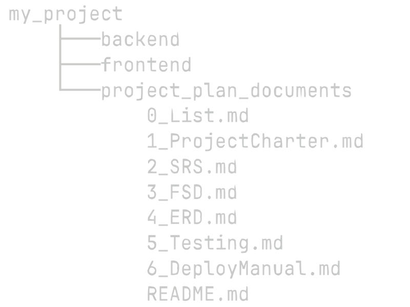

# solo-web-project-plan 🦧
A series of .md files to plan your projects. Not strictly tied to the documents provided (e. g. you could replace 2_SRS.md with IEEE 830 if it fits your use case better).  
While it was though for **solo** and **web** projects, you can adapt this to work with teams and different domains of software.

## Recommended use
Clone the repo and add it to your project's main directory:
  
(This svg is hosted in the repository. Feel free to delete use_tree.svg after cloning)]()