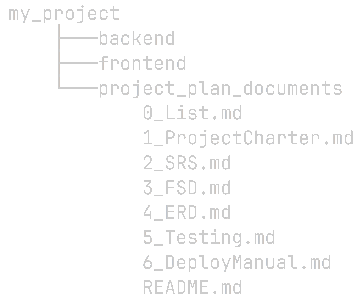

# solo-web-project-plan 🦧
A series of `.md` files to plan your projects. Not strictly tied to the documents provided (e. g. you could replace 2_SRS.md with IEEE 830 if it fits your use case better).  
While it was though for **solo** and **web** projects, it can be adapted to work both with teams and different domains of software.

## Brief overview 🔍
- **0_List**: contains a Markdown checklist & a suggested order to complete the documents.  
- **1_ProjectCharter**: defines most "macro" elements of the project, such as the _problem to solve_, _technical stack_ & _roadmap_.  
- **2_SRS**: describes _core functionalities_, _constraints_ and _requirements_.  
- **3_FSD**: outlines _user stories_, _wireframes_, _traceability requirements_, and others.  
- **4_ERD**: _entity-relationship diagram_ and _table schema_.  
- **API documentation** (if applicable): not defined as a document, but a step.  
- **5_Testing**: _testing scope_, _objectives_, _strategies_, _test cases_, etc.  
- **6_DeployManual**: _system requirements_, _dependencies_ and more.

## Recommended use 🎯
Clone the repo and add it to your project's main directory:  
  
(This image is hosted in the repository. Feel free to delete use_tree.png after cloning)

## Installation 🐣
1. Using the `git clone` command:  
    - HTTPS: `https://github.com/MaxiTonoto/solo-web-project-plan.git`  
    - SSH: `git@github.com:MaxiTonoto/solo-web-project-plan.git`  
2. Download the **.zip** using the `<> Code` button.  
3. Download the **.zip** using the `Releases` section.  

## What I learned 📚
- 👨‍🔧 To apply basic principles from Software Engineering in the planning of web projects.  
- 🗺️ To take a broad perspective on common requirements for solo development.  
- 📃 The importance of documentation, not only for collaborative, but enjoyable work.  
- ⚖️ To balance organizational concerns and the practical execution of the project

## License 📃
MIT License © 2025 [@MaxiTonoto](https://github.com/MaxiTonoto)